```mermaid
flowchart LR
    A["user runs script (python3 mactriage.py [output_dir])"] --> B["parse optional output directory argument"]
    B --> C["determine base directory (argument or script location)"]
    C --> D["create timestamped folder: mac_quickcheck_YYYYMMDD_HHMMSS"]

    D --> E["collect_system_info() -> system_info.txt"]
    E --> F["collect_autoruns() -> autoruns.txt + run autorun heuristics"]
    F --> G["collect_network() -> network_listening_ports.txt, network_all_connections.txt + run network heuristics"]
    G --> H["collect_installs() -> software_installs.txt + run install heuristics"]
    H --> I["collect_quarantine() -> quarantine_events.txt + run quarantine heuristics"]
    I --> J["collect_logins() -> login_activity_1d.txt + run auth heuristics"]

    J --> K{"any suspicious findings?"}
    K -- "yes" --> L["print summary: compromised or suspicious, list findings, exit code 1"]
    K -- "no"  --> M["print summary: not compromised, exit code 0"]

    L --> N["end"]
    M --> N["end"]
```

# ember-guard
a lightweight macos triage and forensic collection tool designed for quick safety checks, troubleshooting, and digital forensics readiness. it gathers key system information, autoruns, network activity, install logs, quarantine events, and login activity, then generates a simple verdict:

- 🟢 not compromised  
- ❗️ compromised (or at least suspicious)

this tool does **not** modify your system. all actions are read-only and safe to run on any mac.

---



---

## features

- collects forensic-relevant data:
  - system info  
  - launch agents & launch daemons  
  - network listeners & active connections  
  - recent install.log entries  
  - quarantine/download events  
  - recent authentication events  
- dynamic output folder creation (no hard-coded paths)
- runs simple heuristic checks to flag suspicious:
  - autorun items  
  - process names  
  - install records  
  - login/auth anomalies  
- produces a clear summary verdict
- cross-user friendly — anyone can drop the script into any folder and run it

---

## requirements

- macos (tested on modern versions with unified logging)
- python 3.8 or later  
- command-line tools typically built into macos:
  - `lsof`
  - `log`
  - `sqlite3`
  - `system_profiler`

---

## installation

clone or download the repository:

```bash
git clone https://github.com/ericlikedis/ember-guard.git
cd ember-guard
